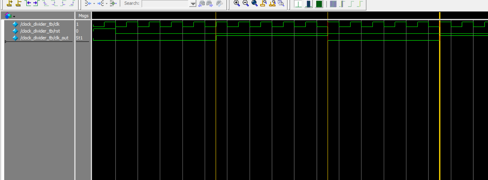

# ⏱️ Verilog Clock Divider

This project implements a **clock divider** in Verilog. It divides the input clock frequency by a specified value, creating a slower output clock. Clock dividers are essential in digital systems to generate slower clocks from high-frequency ones.

---

## 📂 Files Included

| File | Description |
|------|-------------|
| `src/clock_divider.v` | Verilog module that divides the input clock frequency |
| `tb/clock_divider_tb.v` | Testbench for simulation in ModelSim |
| `monitor_log.txt` | Simulation log showing state transitions and timings |
| `wave_clock_divider_tb.png` | Screenshot of waveform captured from ModelSim |
| `clock_divider.vcd` | VCD waveform file used for debugging and viewing in GTKWave |
| `RTL_clock_divider.pdf` | RTL schematic generated by Quartus |
| `README.md` | This documentation file |

---

## 🔁 Clock Divider Behavior

- Divides input clock frequency by **a power of 2** (e.g. divide-by-4)
- Uses a counter that toggles the output when half the period is reached

Example: If clk is 100MHz and you divide by 4, clk_out becomes 25MHz.

yaml
複製
編輯

---

## 📷 Waveform

Captured in **ModelSim**, this waveform shows:

- Input clock `clk`
- Reset `rst`
- Output clock `clk_out` toggles after a fixed number of input clock cycles



---

## 🧠 RTL Schematic

Generated from **Quartus**, the RTL schematic shows how the divider is built from counters and registers:

📎 [View RTL Diagram (PDF)](RTL_clock_divider.pdf)

---

## 🛠️ Tools Used

- **Quartus Prime** – RTL design & schematic generation
- **ModelSim** – Simulation and waveform capture
- **Verilog HDL** – Hardware description language

---

## 🏁 Run the Simulation

To simulate:

```bash
vlog src/clock_divider.v tb/clock_divider_tb.v
vsim work.clock_divider_tb
add wave *
run -all
